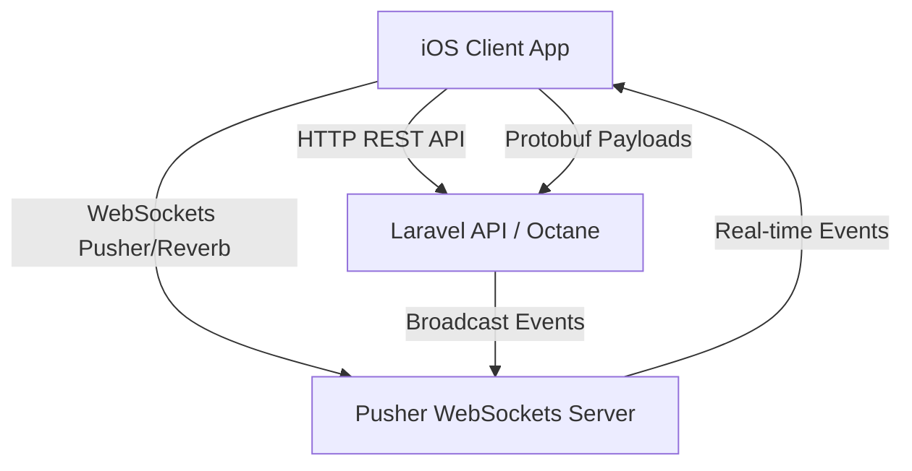

# Glimpse - Master Project Document & System Architecture

Glimpse is a private, real-time couple application that combines precise location sharing, ephemeral photo moments ("Flashes"), multi-room chat with audio messaging, and shared schedule coordination. This document outlines the entire architecture, database schema, module walkthrough, performance optimizations, and future roadmap to serve as the single source of truth for any developer or AI agent working on the codebase.

---

## 1. Project Overview & Tech Stack

The Glimpse project is split into two major components:
1. **Client App (`Glimpse`)**: A native iOS application built using SwiftUI, using MapKit, CoreLocation, CoreMotion, Combine, and SQLite.
2. **Backend API (`glimpse-api`)**: A Laravel PHP backend running Laravel Octane with Roadrunner (`rr`) for high-performance WebSocket broadcasting (via Pusher protocol/Reverb), HTTP endpoints, and Protobuf payload compilation.

### Communication Architecture


---

## 2. Client Architecture (iOS App)

The app is written in **SwiftUI** with a clean structure under the main `Glimpse` directory:

### Core Managers & Singletons
* **[AuthManager.swift](file:///Volumes/LVNPC/Coupleapp/Glimpse/Glimpse/AuthManager.swift)**: Coordinates user sessions, API communication, and core authentication status. Maintains state for both the current user and the partner.
* **[AuthManager+WebSocket.swift](file:///Volumes/LVNPC/Coupleapp/Glimpse/Glimpse/AuthManager+WebSocket.swift)**: Manages Pusher WebSocket handshake, channels subscriptions, and handles real-time messages. Extends the `AuthManager` with thread-safe `@MainActor` event updates.
* **[AuthManager+SQLite.swift](file:///Volumes/LVNPC/Coupleapp/Glimpse/Glimpse/AuthManager+SQLite.swift)**: Implements local message persistence. Houses `GlimpseDatabase` which writes data using SQLite.
* **[LiveLocationManager.swift](file:///Volumes/LVNPC/Coupleapp/Glimpse/Glimpse/LiveLocationManager.swift)**: Coordinates background GPS updates, Wi-Fi BSSID caching, and CoreMotion sleep state detection.
* **[AudioPlayManager.swift](file:///Volumes/LVNPC/Coupleapp/Glimpse/Glimpse/AudioPlayManager.swift)** & **[AudioRecordManager.swift](file:///Volumes/LVNPC/Coupleapp/Glimpse/Glimpse/AudioRecordManager.swift)**: Handle audio message recording and playback.

### Main View Modules
* **[MainDashboardView.swift](file:///Volumes/LVNPC/Coupleapp/Glimpse/Glimpse/MainDashboardView.swift)**: The primary dashboard containing current partner status, active schedules, anniversaries, and navigation. Uses a `LazyVStack` for scroll optimization.
* **[PartnerMapView.swift](file:///Volumes/LVNPC/Coupleapp/Glimpse/Glimpse/PartnerMapView.swift)**: Interactive Map displaying user and partner coordinates, together badges, and custom wavy distance lines. Also handles the ephemeral "Flash Photo" container with swiping.
* **[ChatView.swift](file:///Volumes/LVNPC/Coupleapp/Glimpse/Glimpse/ChatView.swift)** & **[ChatBubbleView.swift](file:///Volumes/LVNPC/Coupleapp/Glimpse/Glimpse/ChatBubbleView.swift)**: Unified messaging panel displaying text, location, replies, audio players, and custom themes.
* **[SchedulePlannerView.swift](file:///Volumes/LVNPC/Coupleapp/Glimpse/Glimpse/SchedulePlannerView.swift)**: A shared scheduler where couples plan dates and coordinate calendar events.

---

## 3. Backend Architecture (Laravel API)

The backend exposes REST endpoints and broadcasts real-time updates:

* **[routes/api.php](file:///Volumes/LVNPC/Coupleapp/glimpse-api/routes/api.php)**: Houses API routing for auth, couple pairing, profile modification, message delivery, and flash photo submissions.
* **[AuthController.php](file:///Volumes/LVNPC/Coupleapp/glimpse-api/app/Http/Controllers/AuthController.php)**: Handles OTP codes, user registration, email verification, Google/Apple social sign-ins, and session terminations.
* **[GlimpseController.php](file:///Volumes/LVNPC/Coupleapp/glimpse-api/app/Http/Controllers/GlimpseController.php)**: Coordinates state retrieval (`getState`), WebSocket typing broadcasts, anniversary configurations, chat room settings, and flash creation.

---

## 4. Key Protocol: Protocol Buffers (Protobuf)

To minimize network bandwidth and latency, Glimpse compiles WebSocket payloads into Protocol Buffers. 

* **iOS Protobuf Class**: **[GlimpseProtobuf.swift](file:///Volumes/LVNPC/Coupleapp/Glimpse/Glimpse/GlimpseProtobuf.swift)**
* **PHP Protobuf Helper**: **[GlimpseProtobuf.php](file:///Volumes/LVNPC/Coupleapp/glimpse-api/app/Helpers/GlimpseProtobuf.php)**

This compiler compiles binary structures for:
1. `GlimpsePartnerStateUpdate`: Transports coordinate, speed, battery, charging status, active Wi-Fi BSSID, and sleep state.
2. `ChatMessage`: Encodes message ID, text, sender, target room, timestamps, and attachment URLs.
3. `GlimpseTypingState`: Communicates typing statuses.

---

## 5. Completed Performance & Threading Optimizations

The application implements several high-performance patterns:

### A. Geocoding Rate-Limiting
* **Problem**: Frequently querying `CLGeocoder` whenever coordinates change by a single meter triggers Apple's rate-limiting blocks and consumes heavy network/CPU.
* **Solution**: Implemented a distance-and-speed-aware debounce filter:
  * When **moving** (> 3 km/h), a geocode request is only fired if the partner has moved at least **150 meters** AND it has been at least **15 seconds** since the last geocode request.
  * When **stationary** (<= 3 km/h), the final location is geocoded once (if distance from last geocoded point is > 15 meters) to guarantee the final address displays correctly, avoiding redundant queries while stationary.

### B. Background WebSocket Parser & @MainActor Binding
* **Problem**: URLSession WebSocket callbacks run on arbitrary background threads. Directly modifying properties from these threads crashes SwiftUI or triggers layout warnings.
* **Solution**: 
  1. Handled WebSocket JSON and binary Protobuf payload decodings entirely on background threads.
  2. Defined a structured `ParsedWebSocketEvent` enum representing pre-parsed payloads.
  3. Dispatched only the final structured event to the `@MainActor` to update states, keeping CPU-heavy parsing entirely off the Main/UI thread.

### C. Async SQLite Writes
* **Problem**: Synchronously writing messages to SQLite in the Main Thread halts the UI loop and causes micro-stutters.
* **Solution**: Refactored `GlimpseDatabase` to delegate all writes (`saveMessage`, `saveMessages`, `clearAllMessages`) asynchronously (`dbQueue.async`) on a dedicated serial background queue, keeping disk operations off the Main thread.

### D. Lazy Loading & Card Swiping Transitions
* **Problem**: The main dashboard list lagged during scrolls, and swiping through photos on the map card felt disconnected because text layouts were outside the transition hierarchy.
* **Solution**:
  1. Replaced the main dashboard `VStack` with a `LazyVStack` to render components on-demand.
  2. Embedded the overlay info cards (`PartnerOverlayCard`) directly inside the photo `TabView`'s page hierarchy, enabling hardware-accelerated 60/120fps sliding.

---

## 6. Future Project Roadmap & Features

Developers can expand the project with these key suggestions:

1. **Shake to Love Bump (Haptic Sensation)**:
   * Detect phone shakes via CoreMotion (`DeviceShakeViewModifier.swift`) and send a real-time `LoveBumpSent` event, triggering synchronized, custom haptic feedback patterns on both partners' devices.
2. **Lockscreen Live Activities**:
   * Implement iOS Live Activities and widgets showing the partner's status notes, battery levels, and distance without opening the app.
3. **Secret Location Time Capsules**:
   * Create location-tied pins on the map that only unlock and display their hidden notes or photos when the partner physically steps inside their GPS radius.
4. **Shared Relationship Gamification (Couple Coupon Shop)**:
   * Track points based on couple check-ins and streaks, allowing partners to redeem points for real-life customizable coupons (e.g. "Dinner Date", "Free Massage") created by each other.

---

## 7. Cloud Backup Configuration (Google Drive)

Glimpse supports native cloud backup of photos and SQLite database messages directly to the user's private Google Drive storage.

### A. Google Cloud Console Setup
To enable Google Sign-In and Google Drive API integration, developers must configure the following in the [Google Cloud Console](https://console.cloud.google.com/):
1. **Create/Select Project**: Set up a project in Google Cloud Console.
2. **Enable APIs**: Navigate to **Enabled APIs & Services**, click **+ ENABLE APIS AND SERVICES**, and enable the **Google Drive API**.
3. **OAuth Consent Screen**: 
   * Configure the Consent Screen as **External**.
   * App Name: `Glimpse`
   * Add the required scopes: `.../auth/drive.file` and `.../auth/userinfo.email`.
   * Add test user email addresses if the app is still in testing mode.
4. **Create Credentials**:
   * Click **Create Credentials** > **OAuth Client ID**.
   * Application Type: **iOS**.
   * Name: `Glimpse iOS Client`
   * **Bundle ID**: Must exactly match the app's Bundle Identifier: `Veracious.Glimpse`.
   * Leave *App Store ID* and *Team ID* blank (or set them if publishing to App Store).
5. **Retrieve Client ID**:
   * Copy the generated **Client ID** (e.g., `302722862393-lmqomnd2h74u33obukankjqnta97grc1.apps.googleusercontent.com`).
   * The **Reversed Client ID** will be `com.googleusercontent.apps.302722862393-lmqomnd2h74u33obukankjqnta97grc1`.

---

### B. App Code Configuration
1. **Ensure Client ID in Manager**:
   Open [GoogleDriveBackupManager.swift](file:///Volumes/LVNPC/Coupleapp/Glimpse/Glimpse/GoogleDriveBackupManager.swift) and confirm that the fallback/default client ID matches the OAuth Client ID:
   ```swift
   UserDefaults.standard.string(forKey: "google_drive_client_id") ?? "302722862393-lmqomnd2h74u33obukankjqnta97grc1.apps.googleusercontent.com"
   ```
2. **Register Custom URL Scheme in Info.plist**:
   Google OAuth requires registering the **Reversed Client ID** as a custom URL scheme in the iOS project so the redirect callback returns to Glimpse.
   * Open the project settings in Xcode.
   * Under the **Info** tab, expand **URL Types**.
   * Add a new URL Type:
     * **Identifier**: `com.googleusercontent.apps.google-backup`
     * **URL Schemes**: `com.googleusercontent.apps.302722862393-lmqomnd2h74u33obukankjqnta97grc1`
     * **Role**: Editor
   * Alternatively, update [Info.plist](file:///Volumes/LVNPC/Coupleapp/Glimpse/Glimpse/Info.plist) directly with the following dictionary under `CFBundleURLTypes`:
     ```xml
     <dict>
         <key>CFBundleTypeRole</key>
         <string>Editor</string>
         <key>CFBundleURLName</key>
         <string>com.googleusercontent.apps.google-backup</string>
         <key>CFBundleURLSchemes</key>
         <array>
             <string>com.googleusercontent.apps.302722862393-lmqomnd2h74u33obukankjqnta97grc1</string>
         </array>
     </dict>
     ```

---

### C. Backup & Restore Mechanism
* **Folder Structure**: Backups are isolated within the user's private space under a dedicated directory named `Glimpse Memories`.
* **Sync Strategy**:
  1. **Photos**: Only pending/new flash photos are uploaded to avoid redundant transfers. Uploaded photos are stored as `Glimpse_Flash_ID.jpg`.
  2. **Database**: The local SQLite database (`glimpse_chat.sqlite`) containing full message histories is packaged and overwritten inside the Google Drive folder.
* **Database Swapping/Restore**:
  * The restore function downloads the backup SQLite database from Google Drive to a temporary location.
  * It then triggers `GlimpseDatabase.shared.closeAndReplaceDatabase(withTempURL:)` to safely close existing SQLite handles, swap the active database file, and reopen connections without crashing the active UI session.
